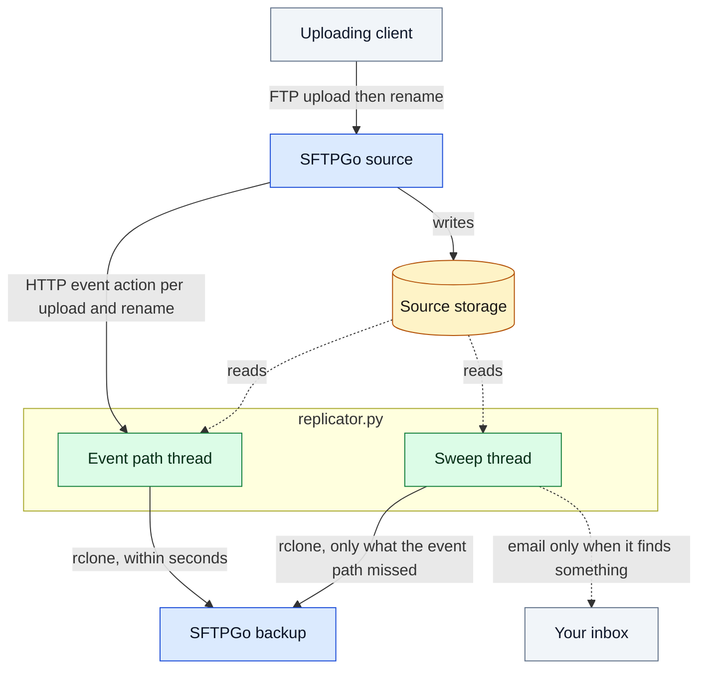

# FTP Replicator

Replicates files from one SFTPGo instance to another, driven by SFTPGo's event actions,
with rclone doing all of the copying.

Extracted from a working deployment. Everything site-specific (paths, hosts, credentials)
is an environment variable, so replicating it is a matter of filling in `.env`.

## The setup



Two paths write to the backup, and only these two:

* **the event path** — the normal one. SFTPGo POSTs every upload and rename to it; it
  pushes the file within seconds.
* **the sweep** — the safety net, every `SYNC_INTERVAL`. Copies whatever the daemon
  missed (crash, restart, failed call, backup offline) and emails a report when it finds
  anything. **An email therefore means the event path dropped one** — that is the signal;
  the daemon itself never mails.

The source instance keeps a short retention (SFTPGo's own data-retention rule); the backup
keeps everything. So the backup is deliberately **not** a mirror: the only thing here that
ever deletes on the backup is the scoped `sync` clearing a renamed file's old names.

## Why it is built this way

Two failure modes drove the design. Both are easy to re-introduce if you simplify it.

**1. The client renames a file while its transfer is still open.** Observed repeatedly:
the rename event arrives ~130 ms *before* the transfer closes, because the rename comes in
on a second connection while the first is still writing. So a rename event says nothing
about whether the file is complete, and any scheme that copies on rename can publish a
short file. Only the *upload* event proves completion — SFTPGo fires it after the transfer
closes.

Hence the consolidation buffer: events for one file accumulate, keyed by the file (a
rename joins the entry its *source* name belongs to, so `A→B→C` stays one entry), and the
entry is released only once it holds an upload event **and** has been quiet for
`SYNC_QUIET_PERIOD`. The last rename target wins; every earlier name is deleted from the
backup, in case a partial copy of one got there.

An entry that never receives an upload event is dropped at `SYNC_MAX_ENTRY_AGE` (4:50),
deliberately just inside the sweep's `--min-age 5m`, so the daemon has let go before the
sweep first considers that file and the two never act on it at once.

**2. A recursive listing over a large tree intermittently omits a freshly written file.**
This made an earlier sweep re-upload files that were present and complete the whole time
(confirmed server-side: the receiver logged a `Remove` of the existing target before the
replacement was renamed in — with a genuinely absent target there is no `Remove`). So the
sweep never trusts a listing alone: it collects candidates with `rclone check`, then
confirms each one with a direct `rclone lsjson --stat` before copying. Listing artefacts
are logged and skipped; only real misses are copied and mailed.

## Components

| File | Role |
| --- | --- |
| `replicator.py` | The whole thing in one process: HTTP endpoints, consolidation buffer, rclone queue, sweep thread, SMTP reports |
| `replicator.sh` | Launcher: installs python3 if the image lacks it, obscures the password, `exec`s the Python |
| `test_replicator.py` | `python3 test_replicator.py` — asserts only, no framework, no network |

It is one process on purpose. The sweep used to be a shell script: assembling JSON log
lines in `sh` means hand-escaping file names that contain spaces and quotes, and mailing a
report meant `msmtp` and `zip` installed at container start. In Python the logger, the
report and the mail are all first-class, and there is a single place to configure. The
launcher does no supervision — if the process dies the container dies with it, so your
runtime restarts it and the failure stays visible.

## Configuration

All via environment (`.env`, see `.env.example`).

| Variable | Default | Meaning |
| --- | --- | --- |
| `RCLONE_CONFIG_BACKUP_*` | — | the rclone remote named `backup:`, defined entirely by env vars |
| `BACKUP_PASS_PLAINTEXT` | — | alternative to `RCLONE_CONFIG_BACKUP_PASS`: given this, `replicator.sh` obscures it at startup, so no one runs `rclone obscure` by hand |
| `RCLONE_CONFIG_BACKUP_KNOWN_HOSTS_FILE` | — | known_hosts path; without it rclone does no host-key validation |
| `SYNC_SRC` | `/data/source` | read-only mount of the source instance's data directory |
| `SYNC_DEST` | `backup:` | rclone remote |
| `SYNC_DAEMON_PORT` | `8787` | daemon listen port; publish it on loopback only |
| `SYNC_QUIET_PERIOD` | `2` | seconds of silence before an entry is released |
| `SYNC_FLUSH_INTERVAL` | `1` | how often the buffer is checked |
| `SYNC_MAX_ENTRY_AGE` | `290` | give-up point; **must stay below the sweep's `MIN_AGE`** |
| `SYNC_RCLONE_TIMEOUT` | `900` | per-invocation timeout |
| `SYNC_INTERVAL` | `300` | seconds between sweeps |
| `MIN_AGE` | `5m` | sweep ignores files younger than this |
| `SMTP_*`, `MAIL_FROM`, `MAIL_TO` | — | msmtp settings for the sweep's reports |
| `MAIL_SUBJECT_PREFIX` | `[replicator]` | subject prefix for those reports |
| `LOG_FORMAT` | `json` | `json` for one object per line, `text` for `[<ISO-8601 UTC>] <component>: <message>` |

## Wiring the source SFTPGo

Two event rules on the source instance, both filtered to the uploading user. No virtual
folder is involved — the backup is reached only by rclone.

* rule on the `upload` filesystem event → HTTP action:
  `POST http://127.0.0.1:8787/upload`, body `{"path":"{{.VirtualPath}}"}`
* rule on the `rename` filesystem event → HTTP action:
  `POST http://127.0.0.1:8787/rename`,
  body `{"path":"{{.VirtualPath}}","target":"{{.VirtualTargetPath}}"}`

Both with header `Content-Type: application/json`. Action type `1` is HTTP; the exact
schema for any field is in the bundled `/usr/share/sftpgo/openapi/openapi.yaml`.

Gotchas found the hard way:

* SFTPGo (2.7.x) has **no `dumpdata` CLI**. Without admin credentials, changes go through
  the sqlite provider DB directly.
* It polls for rule changes roughly every 10 minutes and keys on
  `events_rules.updated_at`. After editing an **action**, bump the parent **rule's**
  `updated_at` or nothing reloads.
* Until that reload happens the old actions keep running from cache. If an old action
  wrote into a virtual folder you just deleted, the path resolves to a **real** directory
  and it quietly starts filling the source tree. Change the rules first, drop the folder
  second.

## Deploying

Any runtime that gives you rclone + python3, a read-only mount of the source data
directory, and a port SFTPGo can reach. `compose.yaml` is one way, not a requirement; `replicator.sh` is the entrypoint.

## Operating it

```sh
# is it alive, and is anything stuck?
wget -qO- http://127.0.0.1:8787/health          # buffered=<n> queued=<n>

# what happened to one file? (after a sweep email)
<your log viewer for this container> | grep '<file name>'

# do the two sides actually agree?
rclone check "$SYNC_SRC" backup:/ --one-way --min-age 5m --size-only
```

All three components log one JSON object per line, the same shape SFTPGo uses, so both
containers filter alike:

```json
{"time":"2026-08-13T15:15:03Z","level":"info","component":"daemon","msg":"rclone ok",
 "event":"rclone","rc":0,"elapsed_ms":2947,"argv":["copy","...","--include","/..."]}
```

The fields are the point — filter on `event` (`upload`, `rename`, `queued`, `rclone`,
`discard`, `copied`, `listing_artefact`, `sweep_done`, …), `path`, `target`, `rc`,
`elapsed_ms`. `LOG_FORMAT=text` restores `[<ISO-8601 UTC>] <component>: <message>` if you
would rather read it directly. rclone's own output keeps its `2006/01/02 15:04:05` format;
that one is not ours to set.
